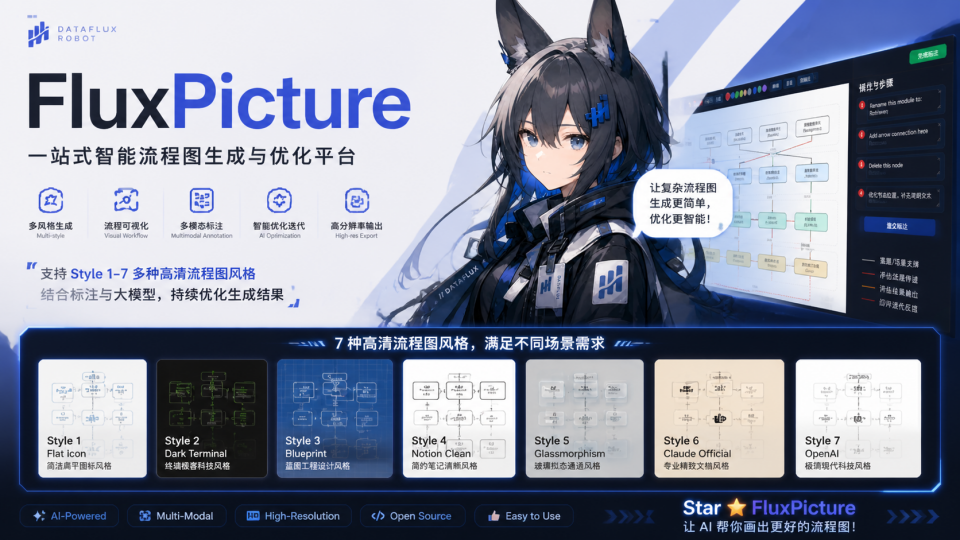
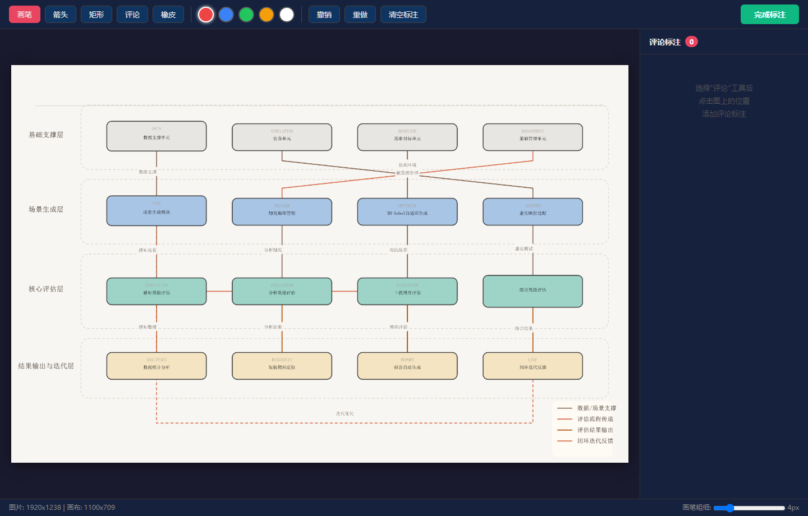
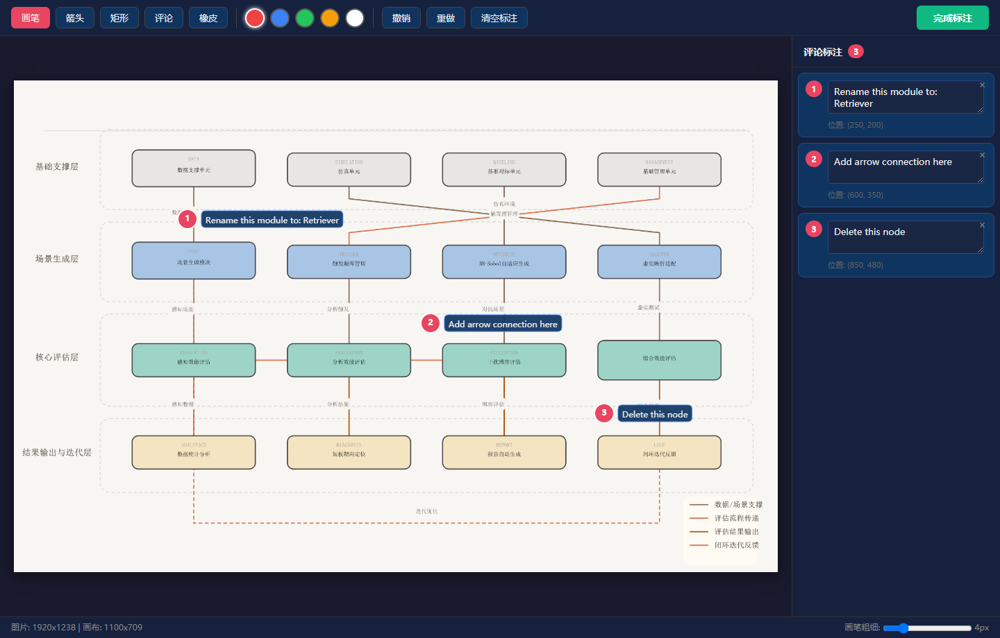

[English](README.md) | [中文](README.zh.md)

<div align="center">
  
</div>

# FluxPicture

> **AI 驱动的图表迭代修正工具。** 生成技术图表、可视化标注问题、让多模态视觉模型智能修正 —— 闭环迭代直到满意。

[](LICENSE)
[](https://modelcontextprotocol.io)
[]()
[]()
[]()

---

## FluxPicture 的核心创新

传统图表工具在"生成"一步就结束了，用户只能接受或手动修改。FluxPicture 在此基础上引入了**多模态视觉模型的闭环迭代修正**：

1. **生成** — 通过 `fireworks-tech-graph` skill 从自然语言描述生成 SVG/PNG 图表
2. **标注** — 在浏览器中打开标注工具，支持画笔、箭头、矩形和**评论图钉**直接在图上标记问题
3. **修正** — 将标注图片 + 结构化评论发送给视觉模型（GLM-5V）进行智能 JSON 修正
4. **重新渲染** — 生成更新后的图表，循环迭代直到满意

```
用户: "画一个 RAG 流水线架构图"
  → Skill 生成初始 SVG/PNG
  → 用户: "不满意"
  → 浏览器标注工具打开 —— 用户画箭头、添加评论：
      #1: "这个模块应该改名为 'Retriever'"
      #2: "从 Cache 加一条箭头到 LLM"
      #3: "删除这个节点"
  → GLM-5V 分析图片 + 评论 → 输出修正后的 JSON
  → 重新渲染 → 循环直到满意
```

---

## 系统架构

```
Claude Code
  ├── fireworks-tech-graph skill    (SVG/PNG 图表生成)
  └── FluxPicture MCP Server        (闭环迭代修正)
        ├── render_diagram          → JSON → SVG + PNG
        ├── ask_satisfaction        → 询问用户是否满意
        ├── open_annotator          → 打开浏览器标注工具
        └── refine_with_vision      → GLM-5V 多模态修正
```

---

## 核心组件

### MCP Server (`mcp_server.py`)

通过 Model Context Protocol 暴露 4 个工具：

| 工具 | 描述 |
|------|------|
| `render_diagram` | 从 JSON 渲染 SVG + PNG |
| `ask_satisfaction` | 展示图表并询问用户反馈 |
| `open_annotator` | 打开浏览器标注工具（含评论功能） |
| `refine_with_vision` | GLM-5V 分析标注 + 评论 → 修正 JSON |

### 浏览器标注工具 (`annotator/`)

在 `localhost:8765` 提供的单页标注工具：

- **画笔** — 5 色自由绘制
- **箭头** — 方向箭头
- **矩形** — 虚线选择框
- **评论** — 编号图钉 + 右侧面板可编辑文字（核心功能）
- **橡皮** — 擦除标注

评论以结构化 JSON 保存（与标注图片并列），为视觉模型同时提供视觉上下文（画布上的图钉和文字）和精确文本（JSON 中的评论内容）。


*标注器界面：顶部工具栏包含画笔/箭头/矩形/评论/橡皮，画布展示生成的图表*


*画布上的编号图钉 + 右侧面板可编辑文字。视觉（画布）和结构化（JSON）双通道反馈，供视觉模型精确修正。*

### 视觉修正客户端 (`core/vision_client.py`)

将标注图片 + 修正提示发送至 GLM-5V 多模态 API，使用智谱 AI 的 `glm-4v-plus` 模型。

### SVG 引擎 (`core/svg_engine.py`)

封装 `generate-from-template.py`，支持 SVG 生成和 PNG 导出（通过 Qt 或 sharp）。

---

## 效果展示

### 风格 6 — Claude 官方风格
*系统架构图 — 温暖奶油色背景，Anthropic 品牌色*


### 风格 1 — 扁平图标风（默认）
*Mem0 记忆架构图 — 白底，语义箭头*


### 风格 2 — 暗黑极客风
*Tool Call 执行流程 — 深色背景，Neon 配色*


### 风格 5 — 玻璃态卡片风
*Multi-Agent 协作图 — 磨砂玻璃卡片*


全部 7 种视觉风格均支持，详见 `references/` 目录。

---

## 支持的图类型

| 类型 | 描述 |
|------|------|
| 架构图 | 服务、组件、水平分层 |
| 数据流图 | 数据流向，箭头标注数据类型 |
| 流程图 | 决策/流程步骤 |
| Agent 架构图 | LLM + 工具 + 记忆（五层模型） |
| 记忆架构图 | 读/写路径分离，记忆层级 |
| 序列图 | 时序消息交互 |
| 对比图 | 功能矩阵、方案对比 |
| 思维导图 | 放射状概念图 |
| 类图 / ER 图 / 状态机图 / 用例图 | 完整 UML 支持（14 种） |

---

## 安装

### 1. 克隆仓库

```bash
git clone https://github.com/ExuberantWitness/FluxPicture.git
```

### 2. 安装依赖

```bash
pip install "mcp[cli]"
```

### 3. 注册为 MCP Server

在项目目录下创建 `.mcp.json`：

```json
{
  "mcpServers": {
    "fluxpicture": {
      "command": "python",
      "args": ["/path/to/FluxPicture/mcp_server.py"],
      "env": { "PYTHONUTF8": "1" }
    }
  }
}
```

或使用 CLI：

```bash
claude mcp add fluxpicture -- python /path/to/FluxPicture/mcp_server.py
```

### 4.（可选）设置 GLM-5V API Key

```bash
export FLUXPICTURE_API_KEY="your-zhipuai-api-key"
```

---

## 文件结构

```
FluxPicture/
  mcp_server.py               # MCP Server 入口（FastMCP）
  annotator/
    server.py                 # HTTP 服务器 (localhost:8765)
    index.html                # 浏览器标注界面
  core/
    svg_engine.py             # SVG 渲染引擎
    vision_client.py          # GLM-5V 多模态 API 客户端
    prompt_builder.py         # 视觉修正 Prompt 模板
    __init__.py
  scripts/
    generate-from-template.py # SVG 模板生成器
    generate-diagram.sh       # 校验 + 导出
    validate-svg.sh           # SVG 语法校验
    test-all-styles.sh        # 批量风格测试
  references/                 # 7 种风格参考文档
  templates/                  # 各图类型 SVG 模板
  fixtures/                   # 示例 JSON
  requirements.txt
```

---

## 7 种视觉风格

| # | 名称 | 背景色 | 适用场景 |
|---|------|--------|----------|
| 1 | **扁平图标风** *(默认)* | `#ffffff` | 博客、幻灯片、技术文档 |
| 2 | **暗黑极客风** | `#0f0f1a` | GitHub README、开发者文章 |
| 3 | **工程蓝图风** | `#0a1628` | 架构设计文档、工程规范 |
| 4 | **Notion 极简风** | `#ffffff` | Notion、Confluence、内部 Wiki |
| 5 | **玻璃态卡片风** | `#0d1117` 渐变 | 产品官网、演讲 Keynote |
| 6 | **Claude 官方风格** | `#f8f6f3` | Anthropic 风格图表 |
| 7 | **OpenAI 官方风格** | `#ffffff` | OpenAI 风格图表 |

---

## 致谢

FluxPicture 基于 [fireworks-tech-graph](https://github.com/yizhiyanhua-ai/fireworks-tech-graph)（作者 [yizhiyanhua-ai](https://github.com/yizhiyanhua-ai)）构建，该项目提供了优秀的 SVG 生成引擎，包含 7 种视觉风格、14 种图类型和 AI/Agent 领域知识。

FluxPicture 在此基础上的主要扩展：
- MCP Server 集成，支持 Claude Code 调用
- 浏览器标注工具，含评论图钉系统
- GLM-5V 多模态视觉修正
- 闭环迭代式图表改进

---

## License

MIT
